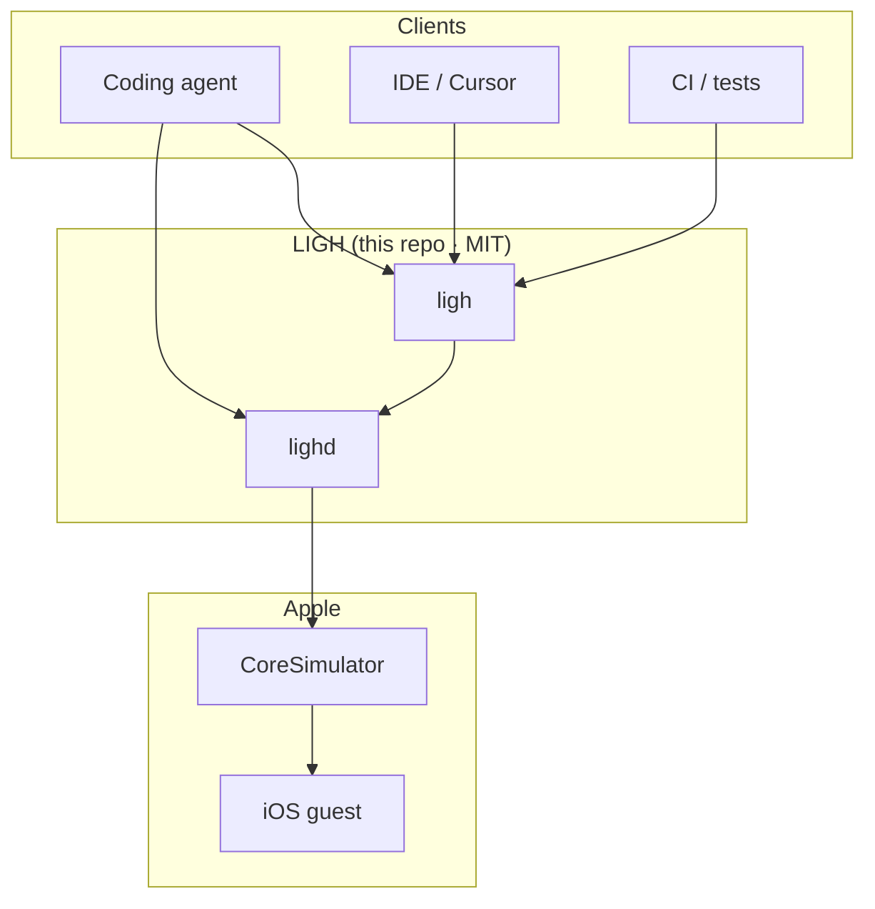

<p align="center">
  
</p>

<h1 align="center">LIGH</h1>

<p align="center">
  <strong>Low-latency iOS execution for AI agents</strong><br/>
  <strong>Open source · MIT</strong>
</p>

<p align="center">
  Persistent Rust host around Apple’s real CoreSimulator.<br/>
  Optimized for <code>observe → act → verify</code> — <strong>local Mac only</strong>, not cloud, not another MCP wrapper.
</p>

<p align="center">
  <em>Real app · observe → act → verify · Messages compose via <code>lighd</code></em>
</p>

<p align="center">
  <strong>~4× faster than WDA/Appium</strong> · 44-step workflow · <strong>0/44 failures</strong>
</p>

<p align="center">
  <a href="#install"><strong>Install</strong></a> ·
  <a href="#demo"><strong>Demo</strong></a> ·
  <a href="#benchmark"><strong>Benchmark</strong></a> ·
  <a href="docs/OBSERVE.md"><strong>Observe contract</strong></a> ·
  <a href="docs/CONSUMER_AGENT_VISION.md"><strong>Consumer Agent Vision</strong></a> ·
  <a href="docs/AGENT.md"><strong>Agent prompt</strong></a> ·
  <a href="ROADMAP.md"><strong>Roadmap</strong></a> ·
  <a href="LICENSE"><strong>MIT License</strong></a>
</p>

<p align="center">
  <a href="LICENSE"></a>
  <a href="https://github.com/mrmarino023/light-ios-simulator"></a>
  <a href="https://www.rust-lang.org/"></a>
  <a href="#install"></a>
</p>

---

## Install

**MIT open source.** Clone, build, run — no account, no license key.

### Requirements

- macOS (Apple Silicon recommended)
- [Xcode](https://developer.apple.com/xcode/) + an **iOS Simulator** runtime
- [Rust](https://rustup.rs/) 1.82+ (`curl --proto '=https' --tlsv1.2 -sSf https://sh.rustup.rs | sh`)

### One-liner (from source)

```bash
git clone https://github.com/mrmarino023/light-ios-simulator.git
cd light-ios-simulator
./scripts/install.sh
```

Puts `ligh` and `lighd` on your PATH (`~/.cargo/bin`). Then:

```bash
ligh doctor                 # env check
ligh daemon start
ligh up                     # boot a sim session
./scripts/demo-type-agent.sh
```

### Homebrew (optional)

```bash
git clone https://github.com/mrmarino023/light-ios-simulator.git
cd light-ios-simulator
brew install --HEAD ./Formula/ligh.rb
ligh doctor
```

### First loop (manual)

```bash
ligh daemon start
ligh up
ligh home
ligh wait --label Impostazioni   # or Settings / Safari / Messaggi
ligh tap --label Impostazioni
ligh observe --json
ligh bench agent --steps 40      # reproducible benchmark
```

WidgetKit stays enabled by default (blank home widgets = slim profile). Opt out: `ligh up --requires nowidgets`.

Stuck? Open an [issue](https://github.com/mrmarino023/light-ios-simulator/issues) — include `ligh doctor` output.

### Reliability & first loop

```bash
./scripts/time-to-first-loop.sh
./scripts/agent-reliability.sh 10 both     # Settings + Messages smokes
# Publish bar: ./scripts/agent-reliability.sh 50 both
```

**Published sample (2026-08-21):** `50×` Settings + `50×` Messages = **100/100 · 0% fail** · p50 ≈ 5.1 s · p95 ≈ 7.3 s.  
Raw: [`docs/assets/agent-reliability-latest.json`](docs/assets/agent-reliability-latest.json).

Workloads: `scripts/workloads/`. Contract: [`docs/OBSERVE.md`](docs/OBSERVE.md). Plan: [`ROADMAP.md`](ROADMAP.md).

**Consumer Agent Vision (frontier):** settled AX scene graph (`surface`, chrome filter, semantic ids) + motor — **not** pixel CV. Screenshots are debug-only.

```bash
./scripts/gate-consumer-vision.sh
# LLM: OPENAI_API_KEY=… LIGH_LLM_GATE=1 OPENAI_MODEL=gpt-5-mini ./scripts/gate-consumer-vision.sh
```

**Published gate (2026-08-21):** substrate motor OK · **LLM 40/40** (20× Settings + 20× Messages, **no PNGs**, `gpt-5-mini`) · claim `llm_20x20_no_png_pass`.  
Raw: [`docs/assets/consumer-vision-gate-latest.json`](docs/assets/consumer-vision-gate-latest.json). Design: [`docs/CONSUMER_AGENT_VISION.md`](docs/CONSUMER_AGENT_VISION.md).  
**Caveat:** loop is settle → surface policy → act → verify (LLM when ambiguous) — not generic computer-use on unlabeled UIs. Vision-only baseline still not run.

Requires a **booted** session (`ligh up`). Scripts wait for SpringBoard AX (IT/EN) — they do not assume English `Safari`/`Settings`.

**One local gate:**

```bash
./scripts/agent-harness.sh
# optional: LIGH_HARNESS_REL_N=10 ./scripts/agent-harness.sh
```

Agent paste-prompt: [`docs/AGENT.md`](docs/AGENT.md). Xcode pin: [`docs/XCODE.md`](docs/XCODE.md).

---

## Demo

Agent loop on a real system app (Messages): home → Messaggi → new message → type.

```bash
ligh daemon start
ligh up
./scripts/demo-type-agent.sh
```

Settings loop (search field): `./scripts/demo-agent.sh`

Clip: [`docs/assets/ligh-messages-demo.mp4`](docs/assets/ligh-messages-demo.mp4) · cover gif above.

---

## What this is

```text
coding agent
    ↓
   LIGH          ← execution layer (persistent daemon)
    ↓
CoreSimulator    ← Apple’s guest, untouched
```

Not a new iOS runtime. Not a thin MCP over `simctl`.  
A **coherent host** for agents that must see and operate a real app: IOSurface + HID + AX + wait semantics + one RPC socket.

---

## Benchmark

| Driver | Time | Failures |
|--------|------|----------|
| **LIGHd** | **10.6–13.2 s** | **0/44** |
| **WDA / Appium XCUITest** | **~50–53 s** | **0/44** |

**~4× vs WDA/Appium** on the same 44-step script (0 failures).

```bash
# Appium in a normal Terminal (CoreSimulator access):
#   APPIUM_HOME=$PWD/.appium ./node_modules/.bin/appium --address 127.0.0.1 --port 4723
ligh daemon start
ligh bench agent --steps 40
```

Raw: [`docs/assets/agent-bench-latest.json`](docs/assets/agent-bench-latest.json).

---

## Why LIGH

**A packaged fast path** agents can call — not a pile of scripts:

| You assemble | LIGH ships |
|--------------|------------|
| simctl lifecycle | `ligh up` / `lighd` |
| AX dump + polling | `wait` / `exists` / `tap --label` |
| IndigoHID | `tap` / `type` / `swipe` / `home` |
| IOSurface / screenshots | `observe` / `screenshot` |
| spawn per tool call | persistent daemon RPC |

DIY wins a lab night. LIGH is **fast + deterministic + observable** for an agent loop.

---

## Agent loop

```text
observe()  →  framebuffer + a11y tree + elements + app state
tap(label=…) / wait(for=…) / type(…)
observe()  again
```

```bash
ligh daemon start
ligh up
ligh wait --label Impostazioni                   # or Settings
ligh tap --label Impostazioni
ligh wait --label Generali                       # wait for destination
ligh tap --label Cerca                           # prefers search/text fields
ligh type --text Bluetooth
ligh wait --label Bluetooth
ligh observe --json                              # structured snapshot
ligh screenshot -o /tmp/frame.png                # optional evidence
```

Daemon keeps IOSurface + HID hot. Prefer `ligh …` over `--direct` (cold process per op).

```text
Agent ──RPC──► lighd (~/.ligh/lighd.sock)
                 ├── observe / ax / wait / exists
                 ├── tap / swipe / home / type
                 ├── screenshot / frame_meta
                 └── framebuffer → Metal / PNG
```

---

## What's included (MIT)

Everything in this repo is open source under the [MIT License](LICENSE):

```text
ligh / lighd
├── simulator lifecycle (headless CoreSimulator)
├── IOSurface → Metal
├── HID (tap · swipe · home · type)
├── accessibility (AXPTranslator dump, wait, tap --label)
├── screenshot / observe JSON
└── Unix socket JSON-lines RPC
```

MCP wrappers belong **on top of** `lighd`, not instead of it. Contributions welcome — see [CONTRIBUTING.md](CONTRIBUTING.md).

### Capability matrix (v0.3)

| # | Capability | Status |
|---|------------|:------:|
| 1 | Low-latency display (IOSurface → Metal) | ✅ |
| 2 | Persistent host (`lighd`) | ✅ |
| 3 | Structured observe (frame + AX) | ✅ |
| 4 | Input (tap / swipe / home / type / `--label`) | 🟡 |
| 5 | Streaming (poll + stats; binary stream next) | 🟡 |
| 6 | Deterministic CLI (`--json`, exit codes) | ✅ |
| 7 | Agent workload bench (30–50 steps) | ✅ |

🟡 = SpringBoard + Settings loops work; AX can be empty mid-transition (use `wait`); tap hold ~32 ms. Not “excellent input.”

---

## Commands

| Command | |
|---------|--|
| `ligh doctor` | Env check |
| `ligh up` / `down` / `status` | Lifecycle |
| `ligh daemon start\|status\|stop` | Persistent host |
| `ligh gui` / `gui --verify` | Metal window |
| `ligh run` / `relaunch` | Install / launch `.app` |
| `ligh wait --label` / `exists --label` | AX barriers |
| `ligh tap --label` / `--x --y` | Tap (label waits) |
| `ligh type --text` | Keyboard HID |
| `ligh swipe` / `home` | Gestures |
| `ligh ax` / `observe [--no-ax]` | Tree / snapshot |
| `ligh screenshot [-o path]` | IOSurface → PNG |
| `ligh bench agent` | Agent workload bench vs WDA/Appium |
| `lighd` | Daemon binary |

Global: `--json`, `--direct` (cold path / benches only).

---

## What we are not

| Claim | Reality |
|-------|---------|
| “Lightweight iOS Simulator” | Same CoreSimulator guest |
| “Nicer Rust simctl / MCP” | Commodity alone — we won’t compete there |
| Guest RAM crusher | Apple owns the guest |
| Screenshot ms is the win | Thesis is the agent workload |

---

## Architecture

LIGH sits **above** CoreSimulator and **beside** the iOS guest. Apple still runs SpringBoard and your `.app`. LIGH replaces **Simulator.app** as the Mac process that boots, renders, injects input, and observes.



| Crate | Role |
|-------|------|
| `ligh-cli` / `ligh-daemon` | Entrypoints |
| `ligh-runtime` | Boot → stream → compositor |
| `ligh-host` | Private boot, IOSurface, HID, AX |
| `ligh-gpu` | Metal + screenshot |
| `ligh-sim` | simctl helpers, bench |
| `ligh-core` | Session, presets, RPC types |

More: [ARCHITECTURE.md](ARCHITECTURE.md) · [docs/OBSERVE.md](docs/OBSERVE.md) · [docs/CONSUMER_AGENT_VISION.md](docs/CONSUMER_AGENT_VISION.md) · [docs/AGENT.md](docs/AGENT.md) · [docs/XCODE.md](docs/XCODE.md) · [ROADMAP.md](ROADMAP.md) · [CONTRIBUTING.md](CONTRIBUTING.md)

---

## License

[MIT](LICENSE) — free to use, modify, and ship. Private Apple frameworks mean you should pin your Xcode version.
