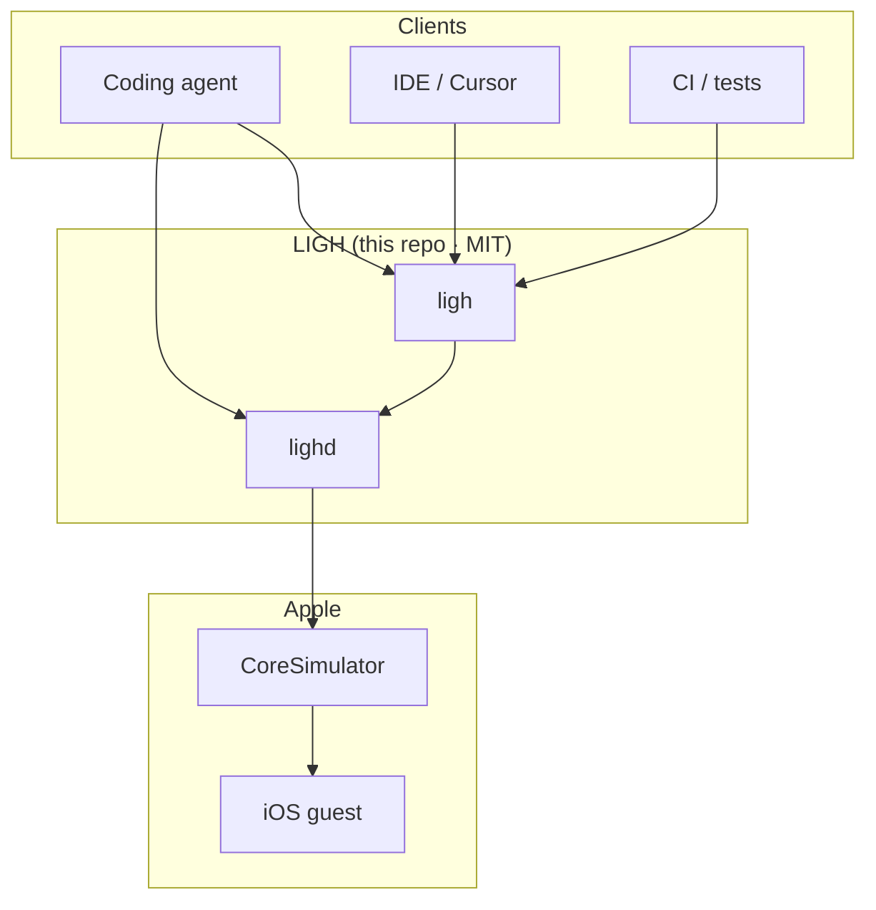

<p align="center">
  
</p>

<h1 align="center">LIGH</h1>

<p align="center">
  <strong>Local Simulator control plane for coding agents</strong><br/>
  <strong>Open source · MIT</strong>
</p>

<p align="center">
  Persistent Rust host around Apple’s real CoreSimulator.<br/>
  Drive <strong>your Debug .app</strong> — settle-honest <code>app-job</code> + MCP · Mac only
</p>

<p align="center">
  <em>install → launch → ensure_path → act → assert · no PNG by default</em>
</p>

<p align="center">
  <strong>Product claim:</strong> coding agent verifies Debug <code>.app</code> via
  <code>app-job</code> — <strong>verified or explicit fault</strong>, never “probably tapped”<br/>
  <a href="docs/assets/app-reliability-latest.json">fixture N=50</a> ·
  <a href="docs/assets/qa-layer-latest.json">QA layer</a> ·
  <a href="docs/QA_LAYER.md">perceive/attempt</a> ·
  <a href="docs/assets/uxgraph-latest.json">UX graph</a> ·
  <a href="docs/UX_GRAPH.md">uxgraph</a> ·
  <a href="docs/HONEST.md">honest status</a> ·
  <a href="docs/assets/fail-closed-latest.json">fail-closed 5/5</a> ·
  <a href="docs/assets/dirty-state-latest.json">dirty 50/50</a> ·
  <a href="docs/assets/third-party-rigor-latest.json">rigor N=50</a> ·
  <a href="docs/assets/mcp-loop-latest.json">agent loop (mechanism)</a> ·
  <a href="docs/assets/cold-start-latest.json">cold start</a>
</p>

<p align="center">
  <a href="#install"><strong>Install</strong></a> ·
  <a href="#demo"><strong>Demo</strong></a> ·
  <a href="#benchmark"><strong>Benchmark</strong></a> ·
  <a href="docs/OBSERVE.md"><strong>Observe contract</strong></a> ·
  <a href="docs/STRUCTURED_CONTROL.md"><strong>Structured control</strong></a> ·
  <a href="docs/DEVELOPER_TRIAL.md"><strong>Developer trial</strong></a> ·
  <a href="docs/AGENT.md"><strong>Agent prompt</strong></a> ·
  <a href="ROADMAP.md"><strong>Roadmap</strong></a> ·
  <a href="LICENSE"><strong>MIT License</strong></a>
</p>

<p align="center">
  <a href="LICENSE"></a>
  <a href="https://github.com/mrmarino023/light-ios-simulator"></a>
  <a href="https://www.rust-lang.org/"></a>
  <a href="#install"></a>
</p>

---

## Install

**MIT open source.** Clone, build, run — no account, no license key.

### Requirements

- macOS (Apple Silicon recommended)
- [Xcode](https://developer.apple.com/xcode/) + an **iOS Simulator** runtime
- [Rust](https://rustup.rs/) 1.82+ (`curl --proto '=https' --tlsv1.2 -sSf https://sh.rustup.rs | sh`)

### One-liner (from source)

```bash
git clone https://github.com/mrmarino023/light-ios-simulator.git
cd light-ios-simulator
./scripts/install.sh
```

Puts `ligh` and `lighd` on your PATH (`~/.cargo/bin`). Then:

```bash
./scripts/developer-trial.sh   # recommended — smoke + Cursor MCP snippet
ligh doctor
```

Full guide: [`docs/DEVELOPER_TRIAL.md`](docs/DEVELOPER_TRIAL.md) · agent prompt: [`docs/CURSOR_PROMPT.md`](docs/CURSOR_PROMPT.md)

### Homebrew (optional)

```bash
git clone https://github.com/mrmarino023/light-ios-simulator.git
cd light-ios-simulator
brew install --HEAD ./Formula/ligh.rb
ligh doctor
```

### First loop (manual)

```bash
ligh daemon start
ligh up
ligh home
ligh wait --label Impostazioni   # or Settings / Safari / Messaggi
ligh tap --label Impostazioni
ligh observe --json
ligh bench agent --steps 40      # reproducible benchmark
```

WidgetKit stays enabled by default (blank home widgets = slim profile). Opt out: `ligh up --requires nowidgets`.

Stuck? Open an [issue](https://github.com/mrmarino023/light-ios-simulator/issues) — include `ligh doctor` output.

### Reliability & first loop

```bash
./scripts/time-to-first-loop.sh
./scripts/gate-cold-start.sh              # daemon bounce → first app-job (< 5 min bar)
```

Workloads: `scripts/workloads/`. Contract: [`docs/OBSERVE.md`](docs/OBSERVE.md) · [`docs/CONTROL.md`](docs/CONTROL.md). Plan: [`ROADMAP.md`](ROADMAP.md).

---

## Product claim (what we sell)

> A coding agent drives **your Simulator Debug `.app`** through one capability — `ligh cap app-job` / MCP `ligh_cap_app_job` — and gets a **fail-closed** outcome: `{ ok, fault, detail }`. Not a screenshot. Not “I think I tapped Login.”

```text
Cursor → build .app → app-job → install/launch → ensure_path → act → settle → verify
                                                              ↓
                                                    verified | fault (explicit)
```

**We do not claim:** “faster than Maestro” or “more reliable than Maestro in general.”  
**We do not claim:** autonomous Cursor can fix arbitrary bugs from a vague prompt (that demo is **not** done yet).  
**We do claim:** structured agent control + reproducible gates you can falsify.

### Demonstrated vs not yet

| Status | What |
|--------|------|
| **Demonstrated** | Third-party OSS app · fail-closed · dirty 50/50 · **rigor N=50** (LIGH 50/50, Maestro 30/50) · ~12× p50 vs Maestro · MCP mechanism · **LLM autonomous (1×)** gpt-5-mini: fault → Swift fix → ok |
| **Not yet** | Autonomous at scale / harder bugs · cross-tool dirty · more apps |
| **Not claimed** | Developer demand · general Maestro superiority · business / moat |

The MCP gate is a **proof-of-mechanism** — the harness scripts the “agent fix.” It shows the primitive is consumable; it is **not** a reliability statistic like 50/50.

### Reproduce the gates

```bash
unset CARGO_TARGET_DIR && cargo build --release   # workspace binaries (see ROADMAP)

# Motor proof (fixture)
./scripts/build-fixture.sh
LIGH_APP_N=50 ./scripts/gate-app-reliability.sh
./scripts/gate-app-bakeoff.sh                   # LighFixture vs Maestro

# Third-party proof (OSS app, not designed for LIGH)
./scripts/gate-xcuitestdemo-bakeoff.sh
./scripts/gate-fail-closed.sh                      # injected faults → explicit fault, never soft-success
LIGH_DIRTY_N=50 ./scripts/gate-dirty-state.sh      # 50× back-to-back, no sim reboot
LIGH_APP_N=50 ./scripts/gate-third-party-rigor.sh  # isolated clean arms: LIGH vs Maestro
./scripts/gate-mcp-loop.sh                       # proof-of-mechanism: scripted fault → fix → ok
LIGH_ENV_FILE=/path/.env ./scripts/gate-autonomous-agent.sh   # 1 hidden bug, LLM
LIGH_ENV_FILE=/path/.env LIGH_MATRIX_N=5 ./scripts/gate-autonomous-matrix.sh  # 5 bugs × N

# Your app
# LIGH_APP_PATH=…/MyApp.app LIGH_APP_BUNDLE_ID=… \
#   LIGH_APP_HOME_ID=… LIGH_APP_FIELD_ID=… LIGH_APP_GO_ID=… LIGH_APP_DONE_ID=… \
#   ./scripts/gate-app-reliability.sh
ligh cap app-job /path/to/MyApp.app --bundle-id com.you.app --steps '[...]'
```

### Published evidence (2026-08-22)

All raw JSON is the source of truth. Summaries below.

**Fixture — LighFixture** (`dev.ligh.Fixture`, job: Home → type → GoNext → Done)

| Gate | Result | JSON |
|------|--------|------|
| Reliability N=50 (multidimensional `claim_pass`) | **50/50** · warm p50 **1.9s** · p95 **4.6s** | [`app-reliability-latest.json`](docs/assets/app-reliability-latest.json) |
| vs Maestro N=10 (same job) | reliability **10/10 = 10/10** · p50 **1.8s vs 20.0s** | [`app-bakeoff-latest.json`](docs/assets/app-bakeoff-latest.json) |
| Cold start (daemon bounce → app-job) | **10.6s** (budget 5 min) | [`cold-start-latest.json`](docs/assets/cold-start-latest.json) |

**Third-party — [XCUITestDemo](fixtures/third-party/XCUITestDemo)** (`com.himali.XCUITestDemo`, OSS login sample; job: user+pass → `homeTitle`)

| Gate | LIGH | Maestro | JSON |
|------|------|---------|------|
| Bakeoff N=10 (clean sim) | **10/10** · p50 **2.4s** | **10/10** · p50 **21.7s** | [`third-party-bakeoff-latest.json`](docs/assets/third-party-bakeoff-latest.json) |
| **Fail-closed matrix** | **5/5** injected faults | — | [`fail-closed-latest.json`](docs/assets/fail-closed-latest.json) |
| **Dirty-state N=50** (no reboot between iters) | **50/50** · warm p50 **2.7s** · p95 **5.5s** · 0 AX-empty | — | [`dirty-state-latest.json`](docs/assets/dirty-state-latest.json) |
| **Rigor N=50** (isolated clean arms: reboot → LIGH×50 → reboot → Maestro×50) | **50/50** · p50 **2.2s** · p95 **2.7s** | **30/50** · p50 **27.5s** · p95 **127s** | [`third-party-rigor-latest.json`](docs/assets/third-party-rigor-latest.json) |
| **Agent control loop** | Mechanism demonstrated (4 scripted scenarios) | — | [`mcp-loop-latest.json`](docs/assets/mcp-loop-latest.json) |
| **Autonomous agent (LLM)** | **1/1** proof — gpt-5-mini, vague prompt, structured fault → source fix (not a reliability stat) | — | [`autonomous-agent-latest.json`](docs/assets/autonomous-agent-latest.json) |

**Maestro rigor variance (N=50):**

- **Bimodal failures:** fast aborts (~2.6–5.5s) vs long timeouts (~127–149s) — not a single failure mode.
- **Clustered under load:** most failures land mid/late in the arm, after the first timeout (iter #17); consistent with sim-state degradation on back-to-back Maestro runs, not i.i.d. noise.
- **N=20 was 20/20:** same job, same protocol — reliability only breaks when stretched to N=50.

Raw per-iter data: [`third-party-rigor-latest.json`](docs/assets/third-party-rigor-latest.json).

**Thesis (not speed):** LIGH gives coding agents a **fast, structured, verifiable** interface to a running Debug `.app`. ~12× p50 vs Maestro on this login job is a footnote.

**Autonomous debugging:** one hidden-bug LLM pass (build error + recovery in trace). Next: `./scripts/gate-autonomous-matrix.sh` — 5 bugs × N runs, vague prompt. **Not** sold as general autonomous debugging.

**Agent control loop (mechanism):** scripted MCP gate shows structured failures can be consumed and retried — [`mcp-loop-latest.json`](docs/assets/mcp-loop-latest.json).

**How to read the Maestro comparison**

| Dimension | Fixture | Third-party (XCUITestDemo) |
|-----------|---------|----------------------------|
| Reliability | Tie 10/10 (N=10 bakeoff) | **50/50** LIGH vs **30/50** Maestro (rigor N=50) |
| Latency p50 | LIGH ~11× faster | LIGH ~**12×** faster (rigor N=50) |
| Product wedge | Fail-closed `app-job` + MCP for agents | Same |

These numbers are **one OSS app, one login job** — they do **not** generalize. Latency wins are **bakeoff datapoints**, not the headline claim.

**The product primitive (what matters beyond speed):**

```text
agent → app-job → { ok: false, fault, detail.step } → agent fixes → app-job → { ok: true }
```

That loop is what justifies LIGH for coding agents. Speed on one login job is a footnote.

**Agent loop (MCP):** settled AX + HID — not computer vision. Screenshots = debug only.

```bash
./scripts/agent-first-loop.sh
./scripts/print-cursor-mcp.sh
python3 scripts/ligh_mcp.py
```

### Research only (not the product claim)

Legacy SpringBoard / Settings / vision gates — useful for host settle experiments, **not** marketing:

```bash
./scripts/agent-reliability.sh 10 both     # Settings + Messages smokes
# ./scripts/gate-breadth.sh
# ./scripts/gate-frontier.sh
```

- Settings+Messages **100/100** (2026-08-21) · [`agent-reliability-latest.json`](docs/assets/agent-reliability-latest.json)
- LLM breadth **15/15** · [`breadth-gate-latest.json`](docs/assets/breadth-gate-latest.json)
- Vision / frontier harnesses · [`vision-compare-latest.json`](docs/assets/vision-compare-latest.json) · [`frontier-gate-latest.json`](docs/assets/frontier-gate-latest.json)

Design: [`docs/STRUCTURED_CONTROL.md`](docs/STRUCTURED_CONTROL.md).  
**Caveat:** AX automation is not novel — the product is the **agent contract**, MCP bridge, and **fair falsifiers** (app-job gates + Maestro bakeoff).

### Cursor MCP

```bash
./scripts/print-cursor-mcp.sh   # paste into Cursor → Settings → MCP
```

Or manually:

```json
{
  "mcpServers": {
    "ligh": {
      "command": "python3",
      "args": ["/absolute/path/to/light-simulatior-ios/scripts/ligh_mcp.py"],
      "env": {
        "LIGH_BIN": "/absolute/path/to/light-simulatior-ios/target/release/ligh"
      }
    }
  }
}
```

**App under test (your Debug build):**

```bash
./scripts/app-under-test.sh /path/to/Debug-iphonesimulator/MyApp.app
```

Third-party dogfood: [`docs/THIRD_PARTY_APP.md`](docs/THIRD_PARTY_APP.md).

Requires a **booted** session (`ligh up`). Gates run `agent-first-loop.sh` (SpringBoard AX, IT/EN).

**One local gate (legacy harness):**

```bash
./scripts/agent-harness.sh
```

Agent paste-prompt: [`docs/AGENT.md`](docs/AGENT.md). Xcode pin: [`docs/XCODE.md`](docs/XCODE.md).

---

## Demo

**Product path:** fixture app-job (see [Product claim](#product-claim-what-we-sell)).

**Research demos** (SpringBoard / system apps — not the wedge):

```bash
ligh daemon start
ligh up
./scripts/demo-type-agent.sh    # Messages loop
./scripts/demo-agent.sh         # Settings search
```

Clip: [`docs/assets/ligh-messages-demo.mp4`](docs/assets/ligh-messages-demo.mp4) · cover gif above.

---

## What this is

```text
coding agent (Cursor + MCP)
    ↓
   LIGH app-job     ← fail-closed capability: verified | fault
    ↓
   lighd            ← persistent host (motor, ensure_path, AX)
    ↓
CoreSimulator      ← Apple’s guest, untouched
```

Not a new iOS runtime. Not a thin MCP over `simctl`.  
A **coherent host** for agents that must **verify a Debug `.app` build** with structured outcomes — not PNG cosplay.

---

## Benchmark (research footnote)

Microbench vs WDA/Appium on a **44-step SpringBoard script** — host latency lab, **not** the product claim. See [app-job gates](#published-evidence-2026-08-22) for the wedge metric.

| Driver | Time | Failures |
|--------|------|----------|
| **LIGHd** | **10.6–13.2 s** | **0/44** |
| **WDA / Appium XCUITest** | **~50–53 s** | **0/44** |

```bash
ligh daemon start
ligh bench agent --steps 40
```

Raw: [`docs/assets/agent-bench-latest.json`](docs/assets/agent-bench-latest.json).

---

## Why LIGH

**Packaged agent path for Debug `.app` verification** — not a pile of scripts:

| You assemble | LIGH ships |
|--------------|------------|
| simctl install/launch | `ligh cap app-job` / `ligh run` |
| AX dump + polling | motor `ensure_path` + `wait` / `tap --id` |
| IndigoHID | `tap` / `type` / `swipe` / `home` |
| ad-hoc fault handling | `FaultClass` + `{ ok, fault, detail }` |
| spawn per tool call | persistent `lighd` RPC + MCP |

DIY wins a lab night. LIGH is **deterministic, falsifiable, and agent-native** for app-job loops.

---

## Agent loop

**Preferred (product):**

```text
ligh_cap_app_job(app, steps=[wait/tap/type…])  →  { ok, fault, detail }
```

**Lower level (escape hatch):**

```text
observe()  →  if eyes_unusable → ensure_ready
tap --id / --label  →  observe again
```

```bash
ligh daemon start
ligh up
ligh wait --label Impostazioni                   # or Settings
ligh tap --label Impostazioni
ligh wait --label Generali                       # wait for destination
ligh tap --label Cerca                           # prefers search/text fields
ligh type --text Bluetooth
ligh wait --label Bluetooth
ligh observe --json                              # structured snapshot
ligh screenshot -o /tmp/frame.png                # optional evidence
```

Daemon keeps IOSurface + HID hot. Prefer `ligh …` over `--direct` (cold process per op).

```text
Agent ──RPC──► lighd (~/.ligh/lighd.sock)
                 ├── observe / ax / wait / exists
                 ├── tap / swipe / home / type
                 ├── screenshot / frame_meta
                 └── framebuffer → Metal / PNG
```

---

## What's included (MIT)

Everything in this repo is open source under the [MIT License](LICENSE):

```text
ligh / lighd
├── simulator lifecycle (headless CoreSimulator)
├── IOSurface → Metal
├── HID (tap · swipe · home · type)
├── accessibility (AXPTranslator dump, wait, tap --label)
├── screenshot / observe JSON
└── Unix socket JSON-lines RPC
```

MCP wrappers belong **on top of** `lighd`, not instead of it. Contributions welcome — see [CONTRIBUTING.md](CONTRIBUTING.md).

### Capability matrix (v0.3)

| # | Capability | Status |
|---|------------|:------:|
| 1 | Low-latency display (IOSurface → Metal) | ✅ |
| 2 | Persistent host (`lighd`) | ✅ |
| 3 | Structured observe (frame + AX) | ✅ |
| 4 | Input (tap / swipe / home / type / `--label` / `--id`) | 🟡 |
| 5 | **`app-job` capability + MCP** | ✅ |
| 6 | Streaming (poll + stats; binary stream next) | 🟡 |
| 7 | Deterministic CLI (`--json`, exit codes) | ✅ |
| 8 | App-job reliability gates + Maestro bakeoff | ✅ |

🟡 = SpringBoard + Settings loops work; AX can be empty mid-transition (use `wait`); tap hold ~32 ms. Not “excellent input.”

---

## Commands

| Command | |
|---------|--|
| `ligh doctor` | Env check |
| `ligh up` / `down` / `status` | Lifecycle |
| `ligh daemon start\|status\|stop` | Persistent host |
| `ligh gui` / `gui --verify` | Metal window |
| `ligh cap app-job` | **Product:** install → motor steps → verify |
| `ligh cap run-app` / `ligh run` | Install / launch `.app` |
| `ligh wait --label` / `exists --label` | AX barriers |
| `ligh tap --label` / `--x --y` | Tap (label waits) |
| `ligh type --text` | Keyboard HID |
| `ligh swipe` / `home` | Gestures |
| `ligh ax` / `observe [--no-ax]` | Tree / snapshot |
| `ligh screenshot [-o path]` | IOSurface → PNG |
| `ligh bench agent` | Agent workload bench vs WDA/Appium |
| `lighd` | Daemon binary |

Global: `--json`, `--direct` (cold path / benches only).

---

## What we are not

| Claim | Reality |
|-------|---------|
| “Lightweight iOS Simulator” | Same CoreSimulator guest |
| “Nicer Rust simctl / MCP” | Commodity alone — we won’t compete there |
| “Faster than Maestro” (headline) | Sometimes true on latency; fixture bakeoff ties reliability (10/10); rigor N=50 is **50/50 vs 30/50** — see bakeoff JSON |
| “~4× vs WDA” (headline) | Research microbench only |
| Guest RAM crusher | Apple owns the guest |
| Screenshot ms is the win | Thesis is **app-job + fail-closed outcomes** |

---

## Architecture

LIGH sits **above** CoreSimulator and **beside** the iOS guest. Apple still runs SpringBoard and your `.app`. LIGH replaces **Simulator.app** as the Mac process that boots, renders, injects input, and observes.



| Crate | Role |
|-------|------|
| `ligh-cli` / `ligh-daemon` | Entrypoints |
| `ligh-runtime` | Boot → stream → compositor |
| `ligh-host` | Private boot, IOSurface, HID, AX |
| `ligh-gpu` | Metal + screenshot |
| `ligh-sim` | simctl helpers, bench |
| `ligh-core` | Session, presets, RPC types |

More: [ARCHITECTURE.md](ARCHITECTURE.md) · [docs/OBSERVE.md](docs/OBSERVE.md) · [docs/STRUCTURED_CONTROL.md](docs/STRUCTURED_CONTROL.md) · [docs/AGENT.md](docs/AGENT.md) · [docs/XCODE.md](docs/XCODE.md) · [ROADMAP.md](ROADMAP.md) · [CONTRIBUTING.md](CONTRIBUTING.md)

---

## License

[MIT](LICENSE) — free to use, modify, and ship. Private Apple frameworks mean you should pin your Xcode version.
