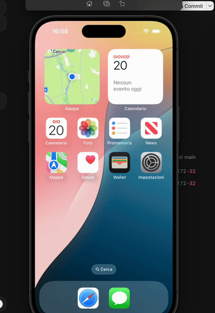

<p align="center">
  
</p>

<h1 align="center">LIGH</h1>

<p align="center">
  <strong>Make coding agents actually use the iOS apps they build.</strong><br/>
  Local iOS Simulator · open source (MIT) · macOS + Xcode
</p>

<p align="center">
  <a href="#try-it"><strong>Try it</strong></a> ·
  <a href="#how-it-works"><strong>How it works</strong></a> ·
  <a href="#what-we-measured"><strong>Evidence</strong></a> ·
  <a href="docs/DEVELOPER_TRIAL.md"><strong>Your app</strong></a>
</p>

---

## The problem

AI coding agents can write Swift. **Getting them to actually run and verify what they built on the Simulator is still painfully slow.**

The goal is not another iOS simulator. It is to make Apple's existing Simulator a **much better execution environment for coding agents**:

```text
write → build → run → interact → verify → fix
```

Tell Cursor:

> *"Add validation to the signup form and verify it works in the Simulator."*

LIGH gives the agent a local control plane: persistent `lighd` on CoreSimulator, accessibility JSON for observe/act, and structured pass/fail results.

**Requires** a Mac with Xcode Simulator. **Works best** with `accessibilityIdentifier` on your views.

---

## What we measured

### Execution layer — observe → act → verify

Same 44-step semantic workflow (Settings → search → assert → screenshot, ×4 cycles):

| | LIGH (`lighd`) | WDA / Appium |
|--|----------------|--------------|
| Wall time | **~10.6 s** | **~50 s** |
| Steps | 44 / 44 | 44 / 44 |
| Failures | 0 | 0 |

~**4.7× faster** than WDA/Appium on the same workflow. Evidence: [`docs/assets/agent-bench-latest.json`](docs/assets/agent-bench-latest.json).

Reproduce: `ligh agent-bench` (WDA baseline needs Appium listening).

### Coding-agent loop — two protocols

**Product path** (host `exercise_app`): OnboardingDemo. Agent fixes Swift; host runs known taps. This measures *edit + host exercise*, not AX-vs-vision.

| Arm | Pass | Wall | LLM tokens |
|-----|------|------|------------|
| **LIGH (AX + host exercise)** | yes | **~86 s** | **~27k** |
| Vision baseline | yes | ~204 s | ~73k |
| Hybrid (AX→vision) | no | ~334 s | ~402k |

Evidence: [`docs/assets/killer-loop-ab-latest.json`](docs/assets/killer-loop-ab-latest.json). Reproduce: `./scripts/gate-killer-loop.sh`.

**Historical honest A/B v1** (no host exercise): XCUITestDemo
`login-never-navigates` — same prompt, agent must type/tap via AX **or** vision.
`exercise_app` disabled. Both arms **failed** this run (postcondition not met);
neither modality won.

| Arm | Pass | Wall | LLM tokens | Used exercise_app |
|-----|------|------|------------|-------------------|
| LIGH (AX) | no | ~369 s | ~445k | no |
| Vision baseline | no | ~333 s | ~306k | no |

Evidence: [`docs/assets/killer-loop-ab-honest-latest.json`](docs/assets/killer-loop-ab-honest-latest.json). Reproduce: `LIGH_KILLER_HONEST=1 ./scripts/gate-killer-loop-ab.sh` (needs `OPENAI_API_KEY`).

This v1 result identified the architectural bug: the LLM was still the UI
executor. It is retained as the negative baseline, not presented as a win.

**Honest A/B v2 — Host Autopilot.** Same XCUITestDemo task, injected bug,
model, acceptance target and strict harness. Neither arm receives a step list.
The Autopilot arm restricts the LLM to code (`read/write/build/run_goal`);
Rust discovers and drives the UI path from live Feel IR. Vision still drives
every tap through the LLM.

| Arm | Pass | Wall | LLM tokens | Patches / builds |
|-----|------|------|------------|------------------|
| **LIGH Host Autopilot** | yes | **41.9 s** | **9,034** | 1 / 1 |
| Vision baseline | yes | 152.4 s | 67,040 | 1 / 1 |

That paired run is **3.64× faster wall-clock** and uses **7.42× fewer LLM
tokens**. The UI executor itself used zero LLM tokens. Evidence:
[`docs/assets/killer-loop-ab-v2-latest.json`](docs/assets/killer-loop-ab-v2-latest.json).
Reproduce with `./scripts/gate-killer-loop-ab-v2.sh` (needs
`OPENAI_API_KEY`). The artifact is published regardless of outcome and only
passes when Autopilot both verifies and reaches the 3× threshold.

The same policy also passes the no-special-cases generality gate on **5/5
apps**, covering five different flow shapes:

- **LighFixture** — form: type + submit, 2 actions, 11.5 s
- **LighOnboard** — multi-screen wizard, 4 actions, 17.1 s
- **LighModal** — sheet presentation + confirmation, 2 actions, 12.6 s
- **LighFeed** — list → detail navigation, 1 action, 10.2 s
- **XCUITestDemo** — third-party OSS login with credentials, 3 actions, 10.6 s

There are no per-app branches or recorded flows in Autopilot. Every run receives
only an acceptance goal plus typed data; Rust discovers the path at runtime and
uses **zero LLM UI tokens**. Evidence:
[`docs/assets/autopilot-generality-latest.json`](docs/assets/autopilot-generality-latest.json).
Reproduce with `./scripts/gate-autopilot-generality.sh`.

---

## How it works

```text
Coding agent (Cursor MCP)
        ↓
LIGH host — Autopilot over Feel IR (perceive → plan → act → verify)
        ↓
Apple CoreSimulator
        ↓
Your Debug .app
```

### Three representations (only one is the product wedge)

| | What it is | Who uses it | Role |
|--|------------|-------------|------|
| **Screenshot** | Pixels | Vision LLMs | Fallback when AX is unusable |
| **AX tree** | Raw accessibility dump | Debug / motor | Too big and noisy for planning |
| **Feel IR** | Live interaction frame | Host + thin agent | Default world model |

**Feel IR** is not a screenshot and not a dump of the tree. After every settle, Rust builds a small JSON frame:

```text
place     → where you are (fingerprint, surface, title)
salience  → what weighs (ranked CTAs / fields, top-N)
block     → what blocks (keyboard, alert, sheet)
delta     → what just changed (fp changed? events?)
feel      → phase: settled | transition | blocked | eyes_unusable
suggest   → optional next host act (tap label/id or dismiss)
```

Example shape (agent sees this from `ligh_perceive`):

```json
{
  "place": { "fingerprint": "fp_ab08…", "surface": "app", "title": "Welcome" },
  "salience": [
    { "rank": 1, "kind": "primary_button", "label": "Get Started" },
    { "rank": 2, "kind": "button", "label": "Skip" }
  ],
  "block": null,
  "feel": { "phase": "settled", "keyboard": false, "ready": true },
  "suggest": { "intent": "tap", "label": "Get Started" }
}
```

### Who decides what

```text
LLM (slow, expensive)     →  read/edit Swift, decide what code to fix
Rust Autopilot            →  discover and drive the UI path, verify the goal
Feel IR                   →  the host's live interaction state (~ms update)
strict harness            →  accept/reject the patch without another LLM turn
```

Canonical coding-agent loop on LIGH:

```text
read_file → write_file → build_app → run_goal → host_accept
```

- **`run_goal`** receives an acceptance target plus typed data, never a step list. Rust discovers the path from live Feel IR and drives it with zero LLM UI tokens.
- **`host_accept`** immediately runs the strict harness when the target appears. A passing patch ends the loop before the model can rewrite working code.
- The planner is app-agnostic: field kinds, CTA salience, overlays, deltas and bounded recovery. Per-app flows are forbidden.
- Screenshots are **debug / escalation only** (`ligh_perceive_routed`: AX → ready retry → vision if still `eyes_unusable`).

### What we tried and rejected

A persistent **UX graph** (screens + transitions as LLM memory) was measured and **did not help** agents navigate — they ignored it or used more tokens ([`docs/UX_GRAPH.md`](docs/UX_GRAPH.md)). Feel IR is the opposite design: a **live frame for the computer**, not a history document for the model. The graph remains useful as telemetry / compile-to-replay input (`llm_tokens = 0`), not as agent memory.

### Agent tools (MCP)

| Tool | Job |
|------|-----|
| `ligh_perceive` | Settled world model + **Feel IR** |
| `ligh_attempt` | Act + host verdict (`intent_met`, evidence) |
| `ligh_perceive_routed` | AX-first; vision only on escalation |
| `ligh_cap_autopilot` | Goal + typed data → host-discovered path → verified result (0 UI tokens) |
| `ligh_cap_app_job` | Known multi-step job (CI / fixtures) |

More detail: [`docs/QA_LAYER.md`](docs/QA_LAYER.md) · [`docs/ARCHITECTURE.md`](docs/ARCHITECTURE.md) · [`docs/STRUCTURED_CONTROL.md`](docs/STRUCTURED_CONTROL.md)

---

## Try it

```bash
git clone https://github.com/mrmarino023/light-ios-simulator.git
cd light-ios-simulator
./scripts/install.sh
unset CARGO_TARGET_DIR && cargo build --release -p ligh-cli -p ligh-daemon
./scripts/developer-trial.sh
```

Paste MCP config from `./scripts/print-cursor-mcp.sh` into **Cursor → Settings → MCP**.

Full guide: [`docs/DEVELOPER_TRIAL.md`](docs/DEVELOPER_TRIAL.md)

---

## License

[MIT](LICENSE)
