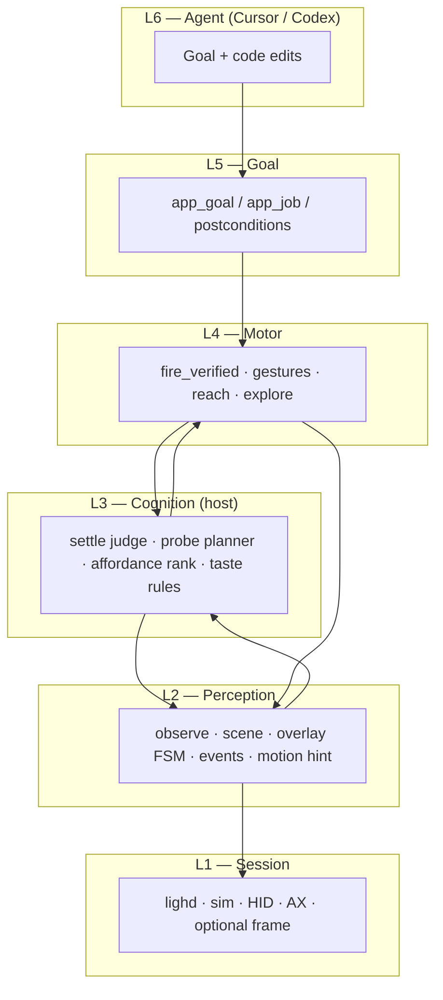
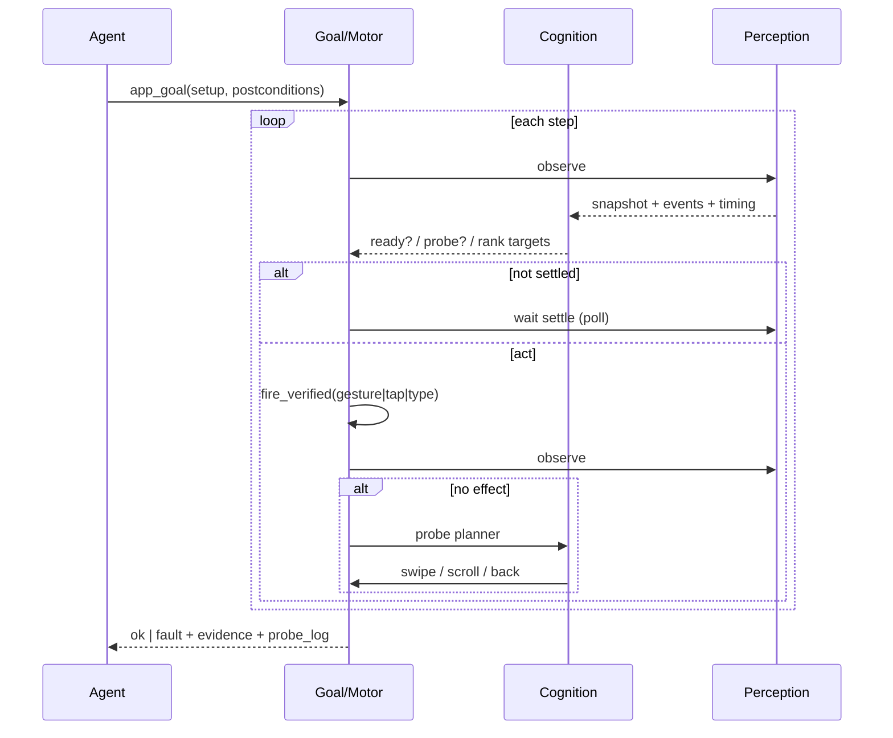

# Human motor — architecture (design contract)

**Status:** P1 implemented (settle judge, explore/probes) · P3 motion hint pending  
**Parent:** [`ARCHITECTURE.md`](ARCHITECTURE.md)

## Problem

A human tester does not only `tap(id)`. They:

- wait until animations finish before acting
- swipe to explore when something is off-screen
- go back when stuck
- search (field → type → submit) in **any** app
- notice “nothing happened” and try a different affordance
- have **product taste**: don’t dismiss a sheet they need, don’t spam taps during transition

LIGH today has pieces of this (`settled`, `events`, `motor_no_effect`, `reach`, swipe in scroll). What’s missing is a **coherent human loop** owned by the host — not scattered demo caps (`settings_search`, `tap_safari` in Python scripts).

## Core split (non‑negotiable)

| Who | Owns |
|-----|------|
| **Host (`lighd`)** | Timing, gestures, exploration probes, verification, structured faults, “product taste” heuristics |
| **Coding agent (LLM)** | Intent (“verify login”, “search in Safari”), source edits, when to give up and fix the app |

The LLM must **not** micromanage swipe coordinates every step. The host must **not** hardcode Settings/Safari flows.

```text
Agent: goal + optional hints (ids, labels)
          ↓
Host:  perceive → judge ready → plan act OR probe → fire+verify → sense → report
          ↓
Agent: read { ok, fault, evidence, probe_log } → fix code or retry
```

---

## Layer model (6 layers)



| Layer | Responsibility | Agent-facing |
|-------|----------------|--------------|
| **L1 Session** | Boot sim, install/launch, HID pipe, AX bridge, IOSurface (optional) | `ligh_up`, `ligh_ready`, `launch` |
| **L2 Perception** | Snapshot + diff | `ligh_observe`, `ligh_sense` |
| **L3 Cognition** | **New.** Is it safe to act? What to try next when stuck? | baked into faults + `evidence.probe` |
| **L4 Motor** | Execute + verify every act | `reach`, `app_goal`, gestures |
| **L5 Goal** | Declarative jobs | `ligh_cap_app_goal` |
| **L6 Agent** | Reasoning on compact evidence | MCP |

---

## L2 — Perception: what the host “feels”

Humans combine channels. LIGH should too — **AX-first**, frame as timing hint, not vision-LLM on every step.

### Signals (today → target)

| Signal | Today | Target |
|--------|-------|--------|
| **AX tree** | `actionable_topk`, full dump | same |
| **Settle / transition** | `ax_quality`, `settled`, `eyes_unusable` | + stability window (N identical fingerprints) |
| **Sense events** | `focus_changed`, `value_changed`, `keyboard_shown`, `navigated` | + `layout_shift`, `spinner_gone`, `list_scrolled` |
| **Overlay FSM** | keyboard / sheet / alert / transition | same, sheet-aware hittability |
| **Motion hint** | indirect (sparse AX during anim) | optional **frame delta rate** from IOSurface (no OCR): “pixels still moving” |
| **Action feedback** | `motor_no_effect` | same + “try gesture X” in evidence |

### `ObserveSnapshot` extensions (v3, planned)

```json
{
  "timing": {
    "settled_ms": 820,
    "stable_fingerprint_streak": 4,
    "motion_score": 0.02,
    "animation_likely": false
  },
  "navigation": {
    "can_go_back": true,
    "surface": "app",
    "screen_title": "Safari"
  }
}
```

**Rule:** if `animation_likely || !settled` → cognition layer returns **`wait`** (host-owned), not `ok: true` on tap.

---

## L3 — Cognition: host intelligence (not the LLM)

This is where “human taste” lives — **deterministic + ranked heuristics**, optionally assisted by a small model later. V1 is rules.

### 3.1 Settle judge

```text
poll observe until:
  ax_quality == ready
  AND actionable_len > 0
  AND stable_fingerprint_streak >= K   // e.g. 3–5 polls
  AND motion_score < threshold         // optional frame channel
OR budget exhausted → eyes_unusable / timeout
```

**Product taste:** acting during transition is how agents tap the wrong thing. Host blocks the act and reports `fault: transition` with `suggestion: wait_settle`.

### 3.2 Affordance ranker (exists: `rank_candidates`)

Rank targets like a human scanning the screen:

1. hittable + enabled + on-screen  
2. editable roles for “search” intent  
3. exact id > exact label > contains label  
4. penalize chrome under keyboard  
5. boost postcondition targets  

Output: `evidence.candidates[]` + `actionable_topk` (already in faults).

### 3.3 Probe planner (new)

When `target_missing` or `motor_no_effect`, host runs a **probe sequence** before failing:

```text
1. dismiss_overlay (keyboard only if target not on overlay)
2. reach (scroll_until on-screen)
3. swipe_up / swipe_down (list explore)
4. swipe_right (iOS back gesture) if can_go_back
5. swipe_left (forward) — rare
6. long_press on ranked candidate (context menu)
7. home + relaunch (last resort, session-level)
```

Each probe: **fire → observe → verify change**. Log `probe_log[]` in evidence for the agent.

```json
{
  "fault": "target_missing",
  "evidence": {
    "candidates": ["Indirizzo", "Cerca"],
    "probes_tried": [
      {"gesture": "scroll_up", "effect": false},
      {"gesture": "swipe_back", "effect": true, "surface": "app"}
    ],
    "suggestion": "Target may be on previous screen; re-observe or fix a11y label"
  }
}
```

Agent sees **what was tried** — like a human saying “I swiped back and still don’t see Login.”

### 3.4 Universal search (replaces `settings_search`)

One motor recipe for Settings, Safari, Maps, your app:

```text
find editable field (ranker + optional hint label/id)
→ tap field (fire_verified)
→ type query
→ submit (return | Go | Vai | Search button — try ranked)
→ wait postcondition (label | title change | value_changed event)
```

No app-specific Rust caps. Locale handled via `labels: ["Indirizzo", "Address"]` or agent-supplied hint from source.

---

## L4 — Motor: gesture vocabulary (universal ops)

All apps, same op set. Debug `.app` and `com.apple.mobilesafari` alike.

| Op | Purpose | Verify success |
|----|---------|----------------|
| `launch` | `bundle_id` | foreground bundle / scene change |
| `wait` | target on clear path | ensure_path ok |
| `tap` / `long_press` | activate | fire_verified |
| `type` | text entry | value_changed / keyboard_shown |
| `key` | return, delete, … | event or field value |
| `dismiss_overlay` | keyboard (careful) | overlay FSM change |
| `scroll_until` | reach off-screen id/label | on-screen in dump |
| `swipe` | `{dir: up\|down\|left\|right, from?, to?}` | layout_shift / new actionable |
| `reach` | host bundle: dismiss + scroll + wait | on-screen |
| `explore` | host bundle: probe planner budget | probe_log + best observe |

### fire_verified (invariant)

Every mutating op:

```text
observe_before → ensure_path → fire (AX → HID tap → HID hold → AX)
→ observe_after → tap_effect_observed?
   yes → ok
   no  → motor_no_effect (+ try next strategy or probe)
```

### Swipe semantics (human)

| Direction | Typical meaning |
|-----------|-----------------|
| **up** | scroll content down / reveal lower list |
| **down** | pull / refresh / scroll up |
| **right** | iOS back (edge) or carousel prev |
| **left** | forward / delete row / next page |

Host picks safe default coordinates from AX root frame (already done in `scroll_until`).

---

## L5 — Goal: how agents declare work

**Prefer `app_goal`** over 40-step LLM loops:

```json
{
  "setup": [
    {"op": "launch", "bundle_id": "com.apple.mobilesafari"},
    {"op": "wait", "labels": ["Indirizzo", "Address"]},
    {"op": "tap", "labels": ["Indirizzo", "Address"]},
    {"op": "type", "text": "apple developer documentation"},
    {"op": "key", "name": "return"}
  ],
  "postconditions": [
    {"wait_label": "Apple", "timeout_ms": 15000}
  ]
}
```

Host runs full cognition + motor + probes inside each step.

---

## Human loop (host-owned)



---

## Product taste rules (explicit)

These are **host policy**, not agent prompts:

1. **Never** return `ok: true` on HID ack without UI change (`motor_no_effect`).
2. **Never** act on `transition` / `eyes_unusable` — wait or `ligh_ready`.
3. **Don’t** dismiss sheet/alert if target is **on** the overlay.
4. **Do** dismiss keyboard before tapping chrome underneath.
5. **Prefer** `reach` over blind coordinate taps.
6. **Prefer** one verified gesture over three blind retries.
7. **Fail closed** with candidates + probes tried — agent fixes a11y or flow, not guesses pixels.
8. **Screenshots** — debug only; happy path is AX + events + optional motion score.

---

## What to delete over time (honesty)

| Legacy | Replace with |
|--------|----------------|
| `settings_search` cap | universal search recipe |
| `open_settings` cap | `launch` + `tap` label |
| `agent-cap-loop.py` safari branch | `app_goal` + universal ops |
| Matrix fixture tuning | external/system app gates |

Demo caps stay until universal path passes the same gates — then remove.

---

## Implementation phases

| Phase | Deliverable | Proves |
|-------|-------------|--------|
| **P0** (now) | `run_motor_step`: launch, labels[], key, universal app_goal | Safari / system apps without special caps |
| **P1** | `swipe` op + verify layout_shift | horizontal nav, carousels |
| **P2** | Probe planner on `target_missing` / `motor_no_effect` | human-like recovery without LLM |
| **P3** | Stable fingerprint + motion_score | “animation too early” |
| **P4** | `explore` cap with budget + probe_log in evidence | agent sees what host tried |
| **P5** | Agentic baseline gate (LIGH vs simctl+vision) | product thesis |

---

## Agent MCP surface (target)

Keep tools small; host does the human work:

| Tool | Role |
|------|------|
| `ligh_observe` | compact scene + topk + events + timing |
| `ligh_cap_app_goal` | primary — full human loop inside |
| `ligh_cap_reach` | single-target explore scroll |
| `ligh_cap_explore` | bounded probe (optional) |
| `ligh_screenshot` | debug only |

Fault payload always includes: `fault`, `step`, `evidence.candidates`, `evidence.probes_tried`, `suggestion`.

---

## Success criteria

LIGH is “human enough” when, **without app-specific code**:

- Safari search job passes via `app_goal` + universal ops
- Injected a11y typo → agent gets `target_missing` + candidates, fixes Swift, green
- Same task vs simctl+vision: fewer tool calls, faster recovery, no coordinate guessing
- Failures are **informative** (probes tried, transition blocked) — not silent wrong taps

That is the architecture worth building. Not 30/30 on fixtures.
